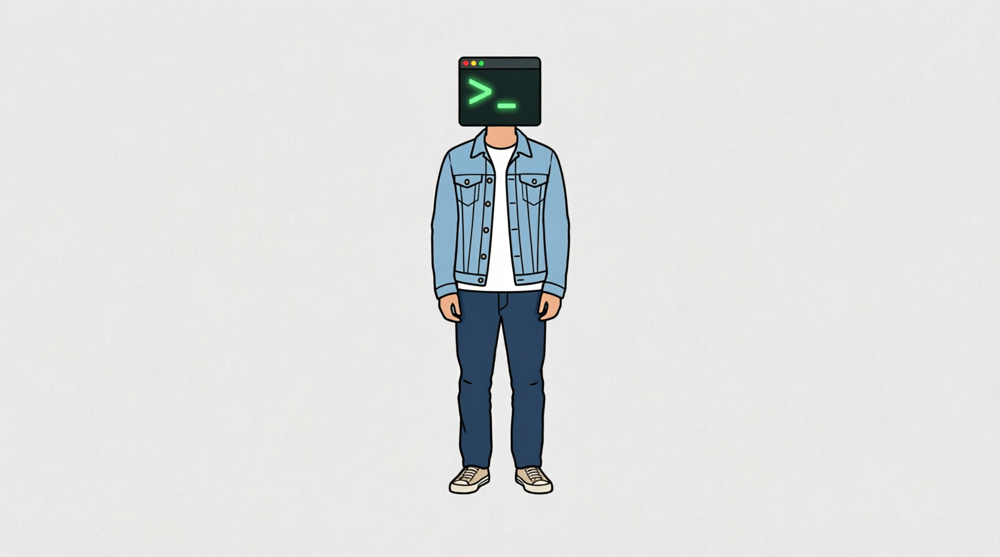

# PHIL

> You no longer own the environment; it owns you. You are the runtime environment. You are not the programmer, but a slave to machine code.

This idea is central to the project.

Imagine: The code shapes the developer, rather than the developer shaping the code.
